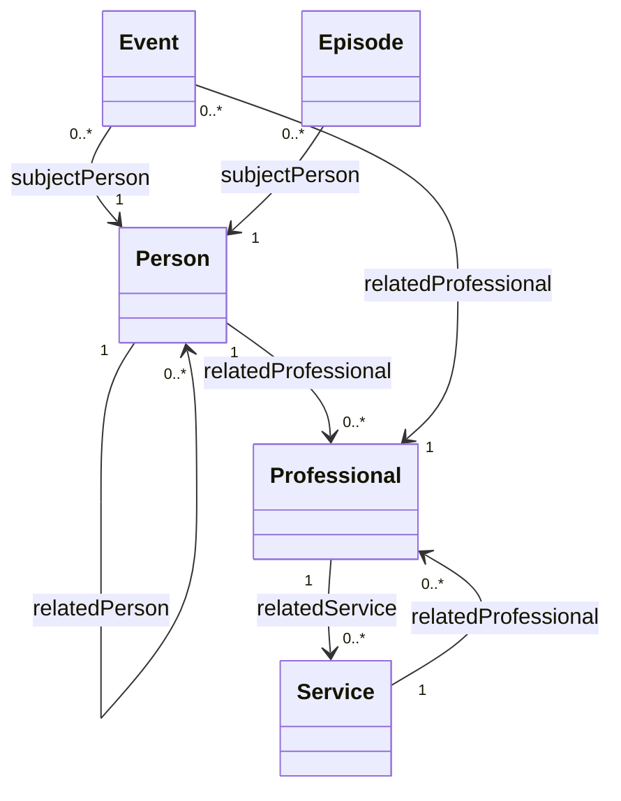

# Logical Model & Terminology

This document defines the conceptual framework for the Multi-Agency Information Sharing (MAIS) data standards. It bridges the gap between high-level stakeholder requirements and the technical JSON-LD/FHIR implementations.

## 1. Terminology: "Ref" vs "Link" vs "Identifier"

To ensure consistency across all standards, we adopt the following definitions:

### A. Identifier (The "Business Key")
An **Identifier** is a tuple (e.g., `value`, `system`) that identifies a person or entity in the physical world (NHS Number, NI Number, UPRN).
- **Usage:** Used for *matching* records across different agency systems.
- **Limitation:** A person might have multiple identifiers, or an identifier might change.

### B. Reference / Ref (The "Pointer")
A **Reference** (or `ref`) is a logical pointer from one record to another.
- **Technical Implementation:** In a decentralised API model, this should ideally be a **URI** (e.g., `https://agency-a.gov.uk/patients/123`).
- **Why use URIs?** A URI is a "Global Link". If I have your URI, I can ask the originating system for the full record without needing to know your NHS number or search for you again.

### C. Link (The "Relationship")
We use **Link** as a data type in our schemas to indicate that a field is a reference.
- **Standard:** Every `Link` field should contain a `ref` (the URI) and optionally a small snippet of data (like a name) to provide context without a lookup.

---

## 2. Directionality in Relationships

Directionality is critical in social care (e.g., "Parent of" is different from "Child of"). We handle this using associations.

### The Association Object
This is the approach used in our `Relationship` standard. It treats the relationship itself as an entity.
- **Source:** The person the record belongs to.
- **Target:** The person being linked to.
- **Predicate:** The type of relationship (from a controlled vocabulary).

**Example:**
If Person A is the "Foster Carer" of Person B:
1. Person A's record has a `RelatedPerson` entry.
2. `ref`: [Link to Person B]
3. `relationship`: "Foster Carer" (This implies A -> B).

**Handling Inverse:**
In a graph, we would like to store the inverse for easier querying. 
- Person B's record: `ref`: [Link to Person A], `relationship`: "Foster Child".
- In fact, ideally, the relationship would be $($ Foster Carer $)^{-1}$ which is parsed as Foster Child. But I don't know if that's a real thing.

### The Rule of Thumb:
> When a link exists inside **Person A's** record, the `relationship` field describes the **Role** that the **Referenced Entity** plays in Person A's life.

**Example 1: Person to Professional**
- **Record:** Person A
- **Link:** `RelatedProfessional: { ref: Professional_P, relationship: "GP" }`
- **Logic:** Professional P is the GP (Subject) for Person A (Object).
- **Benefit:** This allows us to use Professional roles (GP, Social Worker, Teacher) directly as the relationship type.

**Example 2: Person to Person (Asymmetric)**
- **Record:** Child C
- **Link:** `RelatedPerson: { ref: Adult_A, relationship: "Foster Carer" }`
- **Logic:** Adult A is the Foster Carer (Subject) for Child C (Object).

**Example 3: Person to Person (Symmetric)**
- **Record:** Person A
- **Link:** `RelatedPerson: { ref: Person_B, relationship: "Spouse" }`
- **Logic:** Person B is the Spouse of Person A.

This was the only means of describing relationships that felt semantically correct when talking about Person-Professional links, and was then expanded to all relationships. 

---

## 3. The Multi-Agency Graph

The MAIS infrastructure is, in essence, a **Distributed Graph**.
- **Nodes:** Reside in different systems (Health, Police, LA).
- **Edges (Links):** Connect these nodes within and across system boundaries.

### Summary of Logical Entities
| Entity | Description | Primary Key |
| :--- | :--- | :--- |
| **Person** | An individual (Child/Adult). | `Person.Identifier` |
| **Professional** | A practitioner (Social Worker, GP). | `Professional.Identifier` |
| **Service** | An organisation or team. | `Service.Identifier` |
| **Episode** | A duration of involvement. | `Episode.Identifier` |
| **Event** | A point-in-time occurrence. | `Event.Identifier` |

Open question: could the primary key for the professional be their email or something?

## 4. Visualizing the Logical Model

The following diagram represents the relationships between the core entities. Note that links are modeled as "Association Objects" that contain both a reference and a role.

